# Design Document

## Overview

This design document outlines the comprehensive enhancement of the existing CodeIgniter-based Real Estate Management System (RMS) to create a full-featured admin platform. The system will leverage the existing MVC architecture while adding new modules for property management, customer relations, staff management, transaction tracking, and modern dashboard analytics with chart visualization.

The design builds upon the existing database structure and extends it with new tables and relationships to support the complete workflow from property listing to sale completion and ongoing customer management.

## Architecture

### System Architecture
The enhanced RMS follows the existing CodeIgniter MVC pattern with these architectural components:

```
┌─────────────────────────────────────────────────────────────┐
│                    Presentation Layer                        │
├─────────────────────────────────────────────────────────────┤
│  Modern Responsive UI (Bootstrap 5 + Custom CSS)           │
│  - Dashboard with Charts (Chart.js)                        │
│  - Property Management Interface                            │
│  - Customer & Staff Management                              │
│  - Transaction Management                                   │
│  - Reports & Analytics                                      │
└─────────────────────────────────────────────────────────────┘
                              │
┌─────────────────────────────────────────────────────────────┐
│                   Application Layer                         │
├─────────────────────────────────────────────────────────────┤
│  Controllers (Enhanced)                                     │
│  - Properties_controller                                    │
│  - Customers_controller (Enhanced)                          │
│  - Staff_controller (Enhanced)                              │
│  - Transactions_controller                                  │
│  - Dashboard_controller                                     │
│  - Reports_controller                                       │
└─────────────────────────────────────────────────────────────┘
                              │
┌─────────────────────────────────────────────────────────────┐
│                    Business Layer                           │
├─────────────────────────────────────────────────────────────┤
│  Models (Enhanced & New)                                    │
│  - Property_model                                           │
│  - Customer_model (Enhanced)                                │
│  - Staff_model (Enhanced)                                   │
│  - Transaction_model                                        │
│  - Registration_model                                       │
│  - Dashboard_model                                          │
└─────────────────────────────────────────────────────────────┘
                              │
┌─────────────────────────────────────────────────────────────┐
│                     Data Layer                              │
├─────────────────────────────────────────────────────────────┤
│  MySQL Database (Enhanced Schema)                           │
│  - properties, customers (enhanced), staff (enhanced)      │
│  - transactions, registrations, property_assignments       │
│  - audit_logs, system_settings                             │
└─────────────────────────────────────────────────────────────┘
```

### Database Architecture
The enhanced database schema extends the existing structure:

```mermaid
erDiagram
    properties {
        int id PK
        string property_type
        string garden_name
        string location_details
        decimal size_sqft
        decimal price
        string status
        text description
        int assigned_staff_id FK
        timestamp created_at
        timestamp updated_at
    }
    
    customers {
        int id PK
        string plot_buyer_name
        string father_name
        string contact_details
        text address_details
        string id_proof_details
        timestamp created_at
        timestamp updated_at
    }
    
    staff {
        int id PK
        string employee_name
        string designation
        string contact_details
        string employment_details
        timestamp created_at
        timestamp updated_at
    }
    
    registrations {
        int id PK
        int property_id FK
        int customer_id FK
        string registration_number
        date registration_date
        string agreement_path
        string status
        timestamp created_at
    }
    
    transactions {
        int id PK
        int registration_id FK
        decimal amount
        string payment_type
        string payment_method
        date payment_date
        string receipt_number
        text notes
        timestamp created_at
    }
    
    property_assignments {
        int id PK
        int property_id FK
        int staff_id FK
        string assignment_type
        date assigned_date
        date end_date
        timestamp created_at
    }
    
    audit_logs {
        int id PK
        string table_name
        int record_id
        string action
        text old_values
        text new_values
        int user_id
        timestamp created_at
    }
    
    properties ||--o{ registrations : "has"
    customers ||--o{ registrations : "books"
    registrations ||--o{ transactions : "has"
    staff ||--o{ property_assignments : "assigned_to"
    properties ||--o{ property_assignments : "assigned"
```



## Components and Interfaces

### 1. Property Management Component

**Purpose:** Comprehensive property/garden profile management with status tracking

**Key Features:**
- CRUD operations for properties (gardens, plots, houses, flats)
- Status management (Sold, Unsold, Booked)
- Staff assignment to properties
- Property search and filtering
- Bulk operations support

**Interface Design:**
```php
class Property_model extends CI_Model {
    public function create_property($data)
    public function get_properties($filters = [])
    public function update_property($id, $data)
    public function delete_property($id)
    public function change_status($id, $status)
    public function assign_staff($property_id, $staff_id)
    public function get_property_statistics()
}
```

### 2. Registration Management Component

**Purpose:** Handle property sales and bookings with customer linking

**Key Features:**
- Link customers to properties
- Generate unique registration numbers
- Store agreement documents
- Track registration history
- Status workflow management

**Interface Design:**
```php
class Registration_model extends CI_Model {
    public function create_registration($property_id, $customer_id, $data)
    public function get_registrations($filters = [])
    public function update_registration($id, $data)
    public function generate_registration_number()
    public function get_registration_by_property($property_id)
}
```

### 3. Transaction Management Component

**Purpose:** Financial transaction tracking and payment management

**Key Features:**
- Record payments (advance, installments, full payment)
- Payment schedule management
- Receipt generation
- Balance calculations
- Payment history tracking

**Interface Design:**
```php
class Transaction_model extends CI_Model {
    public function record_payment($registration_id, $data)
    public function get_transactions($filters = [])
    public function calculate_balance($registration_id)
    public function get_payment_schedule($registration_id)
    public function generate_receipt($transaction_id)
}
```

### 4. Enhanced Customer Management Component

**Purpose:** Comprehensive customer profile and relationship management

**Key Features:**
- Extended customer profiles
- Property association tracking
- Communication history
- Customer search and filtering
- Relationship mapping

**Interface Design:**
```php
class Customer_model extends CI_Model {
    // Existing methods enhanced
    public function get_customer_properties($customer_id)
    public function get_customer_transactions($customer_id)
    public function search_customers($criteria)
    public function get_customer_statistics()
}
```

### 5. Enhanced Staff Management Component

**Purpose:** Staff profile management and assignment tracking

**Key Features:**
- Comprehensive staff profiles
- Property and customer assignments
- Performance tracking
- Workload distribution
- Assignment history

**Interface Design:**
```php
class Staff_model extends CI_Model {
    // Existing methods enhanced
    public function assign_to_property($staff_id, $property_id, $type)
    public function assign_to_customer($staff_id, $customer_id)
    public function get_staff_assignments($staff_id)
    public function get_staff_performance($staff_id)
}
```

### 6. Dashboard and Analytics Component

**Purpose:** Data visualization and business intelligence

**Key Features:**
- Real-time dashboard metrics
- Interactive charts and graphs
- Trend analysis
- Performance indicators
- Export capabilities

**Interface Design:**
```php
class Dashboard_model extends CI_Model {
    public function get_dashboard_metrics()
    public function get_property_analytics($date_range)
    public function get_financial_analytics($date_range)
    public function get_customer_analytics($date_range)
    public function get_staff_analytics($date_range)
}
```

## Data Models

### Enhanced Database Schema

**Properties Table:**
```sql
CREATE TABLE properties (
    id INT AUTO_INCREMENT PRIMARY KEY,
    property_type ENUM('garden', 'plot', 'house', 'flat') NOT NULL,
    garden_name VARCHAR(255) NOT NULL,
    district VARCHAR(100),
    taluk_name VARCHAR(100),
    village_town_name VARCHAR(100),
    size_sqft DECIMAL(10,2),
    price DECIMAL(15,2),
    status ENUM('unsold', 'booked', 'sold') DEFAULT 'unsold',
    description TEXT,
    assigned_staff_id INT,
    created_at TIMESTAMP DEFAULT CURRENT_TIMESTAMP,
    updated_at TIMESTAMP DEFAULT CURRENT_TIMESTAMP ON UPDATE CURRENT_TIMESTAMP,
    FOREIGN KEY (assigned_staff_id) REFERENCES staff(id)
);
```

**Registrations Table:**
```sql
CREATE TABLE registrations (
    id INT AUTO_INCREMENT PRIMARY KEY,
    registration_number VARCHAR(50) UNIQUE NOT NULL,
    property_id INT NOT NULL,
    customer_id INT NOT NULL,
    registration_date DATE NOT NULL,
    agreement_path VARCHAR(500),
    status ENUM('active', 'completed', 'cancelled') DEFAULT 'active',
    total_amount DECIMAL(15,2),
    paid_amount DECIMAL(15,2) DEFAULT 0,
    created_at TIMESTAMP DEFAULT CURRENT_TIMESTAMP,
    FOREIGN KEY (property_id) REFERENCES properties(id),
    FOREIGN KEY (customer_id) REFERENCES customers(id)
);
```

**Transactions Table:**
```sql
CREATE TABLE transactions (
    id INT AUTO_INCREMENT PRIMARY KEY,
    registration_id INT NOT NULL,
    amount DECIMAL(15,2) NOT NULL,
    payment_type ENUM('advance', 'installment', 'full_payment') NOT NULL,
    payment_method ENUM('cash', 'cheque', 'bank_transfer', 'online') NOT NULL,
    payment_date DATE NOT NULL,
    receipt_number VARCHAR(50) UNIQUE,
    notes TEXT,
    created_at TIMESTAMP DEFAULT CURRENT_TIMESTAMP,
    FOREIGN KEY (registration_id) REFERENCES registrations(id)
);
```

**Property Assignments Table:**
```sql
CREATE TABLE property_assignments (
    id INT AUTO_INCREMENT PRIMARY KEY,
    property_id INT NOT NULL,
    staff_id INT NOT NULL,
    assignment_type ENUM('sales', 'maintenance', 'customer_service') NOT NULL,
    assigned_date DATE NOT NULL,
    end_date DATE,
    is_active BOOLEAN DEFAULT TRUE,
    created_at TIMESTAMP DEFAULT CURRENT_TIMESTAMP,
    FOREIGN KEY (property_id) REFERENCES properties(id),
    FOREIGN KEY (staff_id) REFERENCES staff(id)
);
```

## Error Handling

### Database Error Handling
- Connection failure recovery with retry mechanism
- Transaction rollback on operation failures
- Detailed error logging with context
- User-friendly error messages
- Data validation before database operations

### Application Error Handling
```php
class Error_handler {
    public function handle_database_error($error)
    public function handle_validation_error($errors)
    public function handle_file_upload_error($error)
    public function log_error($message, $context = [])
    public function display_user_error($message)
}
```

### Validation Framework
- Server-side validation for all inputs
- Client-side validation for immediate feedback
- File upload validation and security
- SQL injection prevention
- XSS protection

## Testing Strategy

### Unit Testing
- Model method testing with PHPUnit
- Database operation testing
- Validation logic testing
- Calculation accuracy testing

### Integration Testing
- Controller-Model integration
- Database transaction testing
- File upload functionality
- API endpoint testing

### User Acceptance Testing
- Workflow testing for each user story
- Cross-browser compatibility
- Mobile responsiveness testing
- Performance testing under load

### Test Data Management
```php
class Test_data_seeder {
    public function seed_properties($count = 50)
    public function seed_customers($count = 100)
    public function seed_staff($count = 10)
    public function seed_transactions($count = 200)
    public function cleanup_test_data()
}
```

## Modern UI/UX Design

### CSS Framework Enhancement
- Upgrade to Bootstrap 5 for modern responsive design
- Custom CSS variables for consistent theming
- Mobile-first responsive design approach
- Dark/light theme support
- Accessibility compliance (WCAG 2.1)

### Chart and Visualization
- Chart.js integration for interactive charts
- Real-time data updates
- Export functionality (PDF, Excel, PNG)
- Responsive chart design
- Color-blind friendly palettes

### User Interface Components
```css
/* Modern CSS Variables */
:root {
    --primary-color: #2563eb;
    --secondary-color: #64748b;
    --success-color: #059669;
    --warning-color: #d97706;
    --danger-color: #dc2626;
    --light-bg: #f8fafc;
    --dark-bg: #1e293b;
}

/* Modern Card Design */
.modern-card {
    background: white;
    border-radius: 12px;
    box-shadow: 0 1px 3px rgba(0, 0, 0, 0.1);
    transition: all 0.3s ease;
}

/* Responsive Grid System */
.dashboard-grid {
    display: grid;
    grid-template-columns: repeat(auto-fit, minmax(300px, 1fr));
    gap: 1.5rem;
}
```

### Performance Optimization
- Lazy loading for large datasets
- Image optimization and compression
- CSS and JavaScript minification
- Database query optimization
- Caching strategy implementation